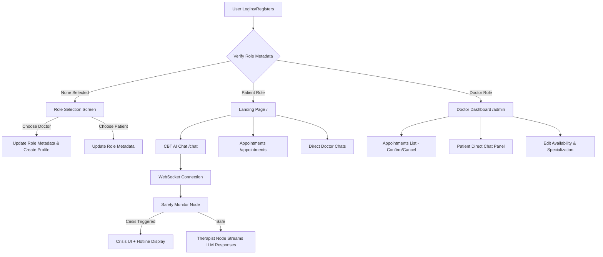

# 🌿 Sera — AI CBT Mental Health Companion

<div align="center">


# 🧠 Sera — Live Agentic AI CBT Companion & Appointment System

**A production-grade AI-powered CBT (Cognitive Behavioral Therapy) companion and appointment booking platform built with Multi-Agent Architecture, LangGraph, FastAPI, WebSockets, Next.js, and Supabase.**

Designed to provide a **safe, private, and real-time mental wellness experience** through intelligent agentic conversations, emotional safety guardrails, doctor-patient matching, and booking scheduling.

<p align="center">
  <a href="https://github.com/himanshukumar-web/mental-health-cbt-companion">
    
  </a>
  
  
  
  
  
</p>

### 🚀 Built for Real-Time Emotional Support, Safety Monitoring, CBT Guidance & Medical Management

🔗 **GitHub Repository**: [https://github.com/himanshukumar-web/mental-health-cbt-companion](https://github.com/himanshukumar-web/mental-health-cbt-companion)

👨‍💻 **Developer:** Himanshu Kumar
🔗 **LinkedIn:** [https://www.linkedin.com/in/himanshu-kumar-813626327](https://www.linkedin.com/in/himanshu-kumar-813626327)

🚀 **Live Vercel Application:** [https://frontend-drab-alpha-72.vercel.app/](https://frontend-drab-alpha-72.vercel.app/)

</div>

---

# 📸 Project Screenshots

## 🏠 Landing Page (Desktop & Mobile Optimized)


---

## 💬 AI CBT Chat Interface


---

# 🧠 Core Features

## 👥 Multi-Role User Portals (Auth-Protected)
Upon signup or login, users are routed to a **Role Selection** screen where they choose their profile type:
* **Patient Portal**:
  * Chat with **Sera**, the AI CBT wellness therapist.
  * Search, view, and book appointment slots with mental health professionals.
  * Direct Messaging (DM) panel to chat live with assigned doctors.
  * View booked sessions and status tracking (Pending, Confirmed, Completed, Cancelled).
* **Doctor/Admin Portal**:
  * Full dashboard showing real-time metrics (Today's bookings, total patients, completed/pending slots).
  * Appointment manager with instant action links (Confirm, Cancel, or Complete slots).
  * Patient chat panel with active online/offline status indicators.
  * Profile editor to update bio, specialization, availability, and years of experience.

## ⚡ Live WebSocket AI Companion (Multi-Agent)
* Real-time text token streaming over WebSockets for low latency.
* Powered by two cooperative LangGraph nodes:
  1. **Therapist Agent**: Generates emotionally intelligent CBT validation, grounding suggestions, and cognitive reframing prompts.
  2. **Safety Monitor Agent**: Performs O(n) real-time semantic keywords extraction. If high risk or self-harm keywords are detected, the agent immediately halts LLM generation, flags threat levels, and serves a crisis recovery layout.

## 📅 Step-by-Step Booking Wizard
* Interactive calendar date scroller that dynamically locks weekends.
* Slot allocation system displaying available timing configurations (e.g. morning, afternoon slots).
* Optional user textnotes insertion.

## 🔒 End-to-End Encrypted Conversations
* Conversation messages are encrypted at the REST API using AES-256 Fernet encryption before database write, ensuring strict patient privacy.

## ⚡ High-Performance Architecture
* **Query Batching**: Avoids slow loop lookups by merging doctor/patient details inside single SQLite/PostgreSQL `IN` queries.
* **Layout Reflow Optimizations**: Scoped CSS animations to eliminate browser scrolling stutter on low-tier mobile processors.

---

# 🏗️ System Architecture Flow



---

# 🛠️ Tech Stack

| Component | Technologies |
| :--- | :--- |
| **Frontend** | Next.js 16.2 (Turbopack), React 19, CSS3 |
| **Backend** | FastAPI, Uvicorn, Python 3.11 |
| **AI Agents** | LangGraph, LangChain, Anthropic SDK / Groq Llama-3.3-70b |
| **Database** | Supabase (PostgreSQL), SQLite fallback, REST POSTGREST |
| **Realtime** | WebSockets (Heartbeat trackers) |
| **Security** | Fernet Cryptography, Supabase RLS Policies |
| **Hosting** | Vercel (Frontend), Render (Backend) |

---

# 🚀 Getting Started

## 1️⃣ Setup Project Locally
```bash
git clone https://github.com/himanshukumar-web/mental-health-cbt-companion.git
cd mental-health-cbt-companion
```

## 2️⃣ Backend Server Installation
```bash
cd backend
python -m venv venv
# Windows Activation:
venv\Scripts\activate
# Linux/macOS:
source venv/bin/activate

pip install -r requirements.txt
```

### Configure Environment variables (`backend/.env`):
```env
ANTHROPIC_API_KEY=gsk_your_groq_or_anthropic_api_key
SUPABASE_URL=https://your-project.supabase.co
SUPABASE_SERVICE_KEY=your-supabase-service-role-key
ENCRYPTION_KEY=your-fernet-secret-key-32bytes-base64
CORS_ORIGINS=http://localhost:3000
```
> Generate a key in python using: `import cryptography.fernet; print(cryptography.fernet.Fernet.generate_key().decode())`

Start Dev Server:
```bash
python -m uvicorn app.main:app --reload --port 8000
```

## 3️⃣ Frontend Client Installation
```bash
cd ../frontend
npm install
```

### Configure Environment variables (`frontend/.env.local`):
```env
NEXT_PUBLIC_API_URL=http://localhost:8000
NEXT_PUBLIC_SUPABASE_URL=https://your-project.supabase.co
NEXT_PUBLIC_SUPABASE_ANON_KEY=your-anon-key
```

Start Turbopack Client:
```bash
npm run dev
```
Open `http://localhost:3000` to interact with your application!

---

# ⚠️ Mental Health Disclaimer
**Sera is NOT a licensed therapist, clinical doctor, or emergency response service.**
This system is created for **informational support, educational wellness, and CBT reference utility**.

If you are experiencing severe emotional distress or self-harm concerns, contact a professional helpline immediately.

* **India Helplines**: iCall (`9152987821`), AASRA (`91-22-27546669`)
* **US Crisis Service**: `988`

---

# 🧑‍💻 About the Developer
### Himanshu Kumar
* B.Tech Student, Full-Stack Software Developer, AI Enthusiast.
* 🔗 **GitHub**: [https://github.com/himanshukumar-web](https://github.com/himanshukumar-web)
* 🔗 **LinkedIn**: [https://www.linkedin.com/in/himanshu-kumar-813626327](https://www.linkedin.com/in/himanshu-kumar-813626327)
